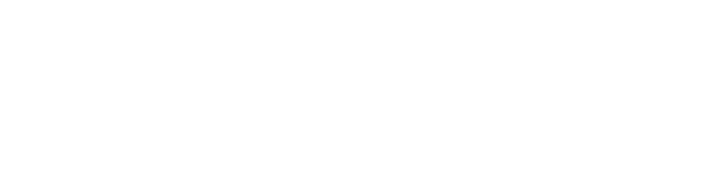

# KuberSee

 
  

    
  

 

## About KuberSee
KuberSee is an open source product with the goal of providing developers an easier way to visualize their Kubernetes clusters in real-time. Through our application, developers can obtain log data on their pods and view information on their pods, nodes, and namespaces. 

## Tech Stacks

            
[![Typescript][TS.js]][TS-url] [![JavaScript][JavaScript]][JavaScript-url] [![React][React.js]][React-url] [![React Router][React Router]][React-Router-url] [![Node.js][Node.js]][Node-url] [![Kubernetes][Kubernetes]][Kubernetes-url] [![Jest][Jest]][Jest-url] [![Tailwind][Tailwind]][Tailwind-url] [![DaisyUI][DaisyUI]][DaisyUI-url] [![MUI][MUI]][MUI-url] [![SocketIO][SocketIO]][SocketIO-url] [![Electron.js][Electron.js]][Electron-url][![Docker][Docker]][Docker-url]

https://github.com/oslabs-beta/KuberSee/assets/124442983/b3f1c2df-390a-4980-bfa0-658924404a3d

## Table of Contents

  <ol>
    <li>
    <a href="#about-kubersee">About KuberSee</a></li>
    <li><a href="#download-the-application">Download the Application</a></li>
    <li><a href="#configuration-of-cloud-kubernetes-cluster">Configuration of Cloud Kubernetes Cluster</a></li>
    <li><a href="#how-to-test-through-minikube">How to Test Through Minikube</a></li>
    <li><a href="#authors">Authors</a></li>
  </ol>

## Download the Application
  - Install the application from www.kubersee.com (for Mac users only)
  - Once installed, locate the application in your Finder. Control-click the app icon and choose "Open" from the shortcut menu to override Apple's default preferences. 
## Configuration of Cloud Kubernetes Cluster
- ### Configure with GCloud: 
  - Enter command line: `gcloud init` This command will guide you through the authentication process and ask you to log in with your Google account using a web browser.
  - Follow the prompts to select your Google Cloud project, authenticate your account, and set your default region and zone.
  - Set Up Kubernetes Configuration: If you are using Google Kubernetes Engine (GKE) to create your Kubernetes clusters, you can use the following command to set up kubectl to use the credentials from your Google Cloud project: `gcloud container clusters get-credentials CLUSTER_NAME --zone ZONE --project PROJECT_ID` Replace CLUSTER_NAME with the name of your GKE cluster, ZONE with the GCP zone where your cluster is located, and PROJECT_ID with your Google Cloud project ID.
  - Verify Credentials: To verify that kubectl is using the correct credentials, you can use the following command to get information about your Kubernetes cluster:`kubectl cluster-info` This command will show you the API server address of your cluster, indicating that you are successfully using the credentials obtained from your Google Cloud project.
  - After following these steps, you should have the necessary credentials to interact with your Google Kubernetes Engine cluster using kubectl. If you need to switch between different Google Cloud projects or clusters, you can use the gcloud config set project PROJECT_ID and kubectl config use-context CONTEXT_NAME commands to switch between configurations.

- ### Configure with Amazon EKS (Elastic Kubernetes Service)
  - Install Dependencies: Ensure you have the following dependencies installed on your machine:
    - AWS CLI: Install the AWS Command Line Interface as explained in the previous response.
    - kubectl: Install kubectl to interact with Kubernetes clusters. You can find installation instructions here: https://kubernetes.io/docs/tasks/tools/install-kubectl/
  - Configure AWS CLI: If you haven't already, configure the AWS CLI with your AWS access keys using the aws configure command. This step is necessary to access the Amazon EKS cluster.
  - Create or Access an Amazon EKS Cluster: Using the AWS Management Console or the AWS CLI, create an Amazon EKS cluster or access an existing one. Note down the cluster name, region, and AWS account ID associated with the cluster.
  - Install AWS IAM Authenticator: Amazon EKS requires the AWS IAM Authenticator to authenticate with your EKS cluster using IAM roles. You can find installation instructions here: https://docs.aws.amazon.com/eks/latest/userguide/install-aws-iam-authenticator.html
  - Configure kubectl for Amazon EKS: Run the following command to update the Kubernetes configuration and associate kubectl with your Amazon EKS cluster:`aws eks update-kubeconfig --name CLUSTER_NAME --region REGION` Replace CLUSTER_NAME with the name of your Amazon EKS cluster and REGION with the AWS region where your cluster is located. This command retrieves the necessary authentication information and updates the Kubernetes configuration file (~/.kube/config).
  - Verify Configuration: You can verify that kubectl is correctly configured to access your Amazon EKS cluster by running a simple command: `kubectl get nodes` This command should return the list of nodes in your Amazon EKS cluster. Now, your Kubernetes configuration is set up, and you can use kubectl to interact with your Amazon EKS cluster and manage Kubernetes resources.
  - Please note that managing Amazon EKS clusters may involve additional steps, such as creating and configuring worker nodes, setting up security groups, and managing IAM roles. For more detailed information on managing Amazon EKS, refer to the official AWS documentation: https://aws.amazon.com/eks/

## How to test through Minikube: 
Note: If Kubernetes Cluster configuration setup with .kube DISREGARD minikube 
- Download Docker Desktop
  - Install Docker Desktop on your device and enable the Kubernetes extension: https://www.docker.com/products/docker-desktop/
- Install Minikube
  - Follow the installation guide for your device and install the appropriate minikube for your operating system. https://minikube.sigs.k8s.io/docs/start/ 
  - On your terminal, start your minikube: `minikube start`
  - Enable metrics: `minikube addons enable metrics-server`
  - Create a pod: `kubectl create deployment hello-node --image=registry.k8s.io/e2e-test-images/agnhost:2.39 -- /agnhost netexec --http-port=8080`
  - When you are done with the session, stop your minikube: `minikube stop`
 

______________________________________________________
## Authors

| Developed By |                                                                     Github                                                                      |                                                                   LinkedIn                                                                    |
| :----------: | :---------------------------------------------------------------------------------------------------------------------------------------------: | :-------------------------------------------------------------------------------------------------------------------------------------------: |
|  Joey Cheng  |        |  |
| Elinor Weissberg |  |    |
|  Jordan Lopez  |     |       |
| Alexis Contreras |     |     |
|  Daniel Zhao   |       |        |

 

[React.js]: https://img.shields.io/badge/react-%2320232a.svg?style=for-the-badge&logo=react&logoColor=%2361DAFB
[React-url]: https://reactjs.org/
[TS.js]: https://img.shields.io/badge/typescript-%23007ACC.svg?style=for-the-badge&logo=typescript&logoColor=white
[TS-url]: https://www.typescriptlang.org/
[D3.js]: https://img.shields.io/badge/d3.js-F9A03C?style=for-the-badge&logo=d3.js&logoColor=white
[D3-url]: https://d3js.org/
[React Router]: https://img.shields.io/badge/React_Router-CA4245?style=for-the-badge&logo=react-router&logoColor=white
[React-Router-url]: https://reactrouter.com/en/main
[JavaScript]: https://img.shields.io/badge/javascript-%23323330.svg?style=for-the-badge&logo=javascript&logoColor=%23F7DF1E
[JavaScript-url]: https://www.javascript.com/
[Node.js]: https://img.shields.io/badge/node.js-6DA55F?style=for-the-badge&logo=node.js&logoColor=white
[Node-url]: https://nodejs.org/
[Kubernetes]: https://img.shields.io/badge/kubernetes-%23326ce5.svg?style=for-the-badge&logo=kubernetes&logoColor=white
[Kubernetes-url]: https://kubernetes.io/
[Jest]: https://img.shields.io/badge/-jest-%23C21325?style=for-the-badge&logo=jest&logoColor=white
[Jest-url]: https://jestjs.io/
[Docker]: https://img.shields.io/badge/docker-%230db7ed.svg?style=for-the-badge&logo=docker&logoColor=white
[Docker-url]: https://www.docker.com/
[DaisyUI]: https://img.shields.io/badge/daisyui-5A0EF8?style=for-the-badge&logo=daisyui&logoColor=white
[DaisyUI-url]: https://daisyui.com/
[Tailwind]: https://img.shields.io/badge/Tailwind-%231DA1F2.svg?style=for-the-badge&logo=tailwind-css&logoColor=white
[Tailwind-url]: https://tailwindcss.com/
[MUI]: https://img.shields.io/badge/MUI-%230081CB.svg?style=for-the-badge&logo=mui&logoColor=white
[MUI-url]: https://mui.com/
[SocketIO]: https://img.shields.io/badge/Socket.io-black?style=for-the-badge&logo=socket.io&badgeColor=010101
[SocketIO-url]: https://socket.io/
[Electron.js]: https://img.shields.io/badge/Electron-191970?style=for-the-badge&logo=Electron&logoColor=white
[Electron-url]: https://www.electronjs.org/
